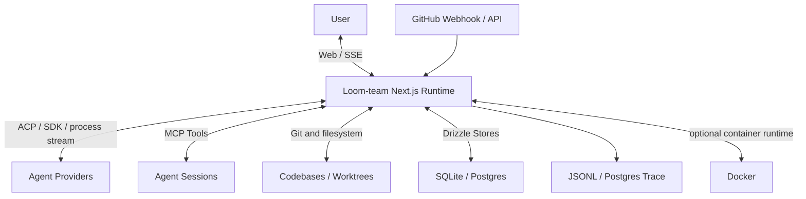
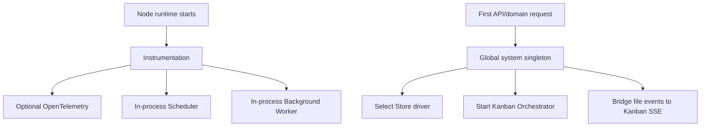
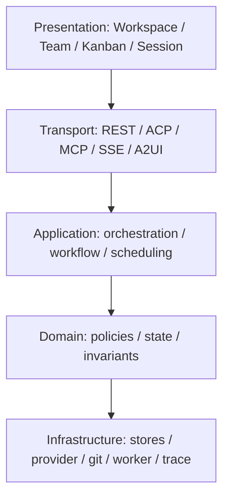

# 系统总览

## 1. 系统定位

Loom-team 是面向研发任务的多 Agent 协作平台。它将 Workspace、Session、Task、Kanban、Codebase、Worktree、Notes、Artifacts 和治理能力组合为一个 Web 控制面。

## 2. 当前系统上下文

## 3. 运行拓扑

### Current

Next.js 同时承载页面和 API。Node 启动时可初始化 Telemetry、Scheduler 和 Background Worker；首次取得系统容器时会装配 Store、Tool、EventBus，并启动 Kanban Workflow Orchestrator。

### Transitional

- `globalThis` 单例用于承受开发 HMR，也使多个长期状态与单进程绑定。
- 部分应用服务通过内部 HTTP 调用自身 API，复用行为但增加运行依赖。
- `default` Workspace 仍出现在兼容和引导流程。

### Target

保持模块化单体作为控制面；只有当多实例、远程仓库或资源隔离成为刚需时，才分离 Agent Runner 和共享事件基础设施。

## 4. 逻辑分层

边界规则：Core 不依赖 App 或 Client，API 不依赖 Client。当前这些架构检查属于 advisory，应在违例清理后逐步升级为强门禁。

## 5. 主要能力域

| 能力域         | 当前职责                                       |
| ----------- | ------------------------------------------ |
| Workspace   | 资源导航、仓库、Session、Task 和 Note 作用域            |
| ACP Runtime | Provider 发现、Session、Prompt、流式事件和恢复         |
| MCP         | Agent 协作 Tool 和 Profile 化写边界               |
| Team        | Root/Child Session、Team Chain、委派和报告        |
| Kanban      | Task 流转、Lane Session、Queue 和 Gate          |
| Workflow    | YAML Definition、Background Task 和依赖输出      |
| Runtime     | Local/Docker Worker、Sandbox、Git 和 Worktree |
| Knowledge   | Notes、Artifacts、Memory、Trace 和 Transcript  |
| Governance  | Fitness、Harness、Review、Spec 和架构检查          |
|             |                                            |

## 6. 产品执行模式

三种执行模式共用 Workspace、Session、Task、ACP 和 Provider 基础设施，但拥有不同的编排中心，不能简化为三个界面入口。

| 模式 | 编排中心 | 核心链路 | 适用场景 |
|---|---|---|---|
| Session | 一个持续会话，由用户或 Lead 按需动态委派 | 用户请求 → Root Session → 可选 Child Session → 汇总 | 探索、连续对话、边做边调整 |
| Kanban | Task 所在列、列策略、Queue 和 Gate | 建卡 → 入列 → 自动 Lane → 证据校验 → 迁移 | 明确工作项、可视化流程、持续推进 |
| Team | 固定 Team Lead 作为根协调者，按执行链分波次委派 | 创建 Team Run → 规划 → 子会话执行 → 验证 → 汇报 | 多角色协作、跨目录或复杂交付 |

Team 的执行链预设为 `lightweight`、`standard_delivery`、`full_delivery`。预设在启动时确定角色组合与验证深度；运行中不切换链路，以免已创建的 Session、Task 和责任关系失去稳定解释。未显式指定时保留 Full Delivery 的兼容语义。

Kanban 不是静态看板：开发类列通常触发执行 Agent，评审和完成列承担 Gate 检查；Board 并发、watchdog/Ralph loop 和服务器端 Gate 共同构成自动化语义。

设计依据：[Execution Modes](../design-docs/execution-modes.md)。

## 7. 架构不变量

1. 新资源应显式携带 Workspace。
2. Provider 私有数据应在 Adapter 边界内归一化。
3. Task 流转规则必须同时约束 UI/API/MCP。
4. Session 持久元数据与 Provider-native ID 不得混用。
5. 实时事件不是权威状态；重连后应能从持久历史恢复。
6. 高风险执行必须经过 Sandbox/Permission 边界。
7. Session、Kanban、Team 共享底层能力，但各自的编排中心和生命周期不得互相替代。
8. Workspace 是产品上下文；`default` 仅是迁移兼容值，不是目标租户模型。

## 8. 当前适用边界

当前最适合可信本地或单实例自托管环境。公网多租户、多副本和纯 Serverless 不属于无需改造即可安全运行的形态。

[返回目录](./README.md)
