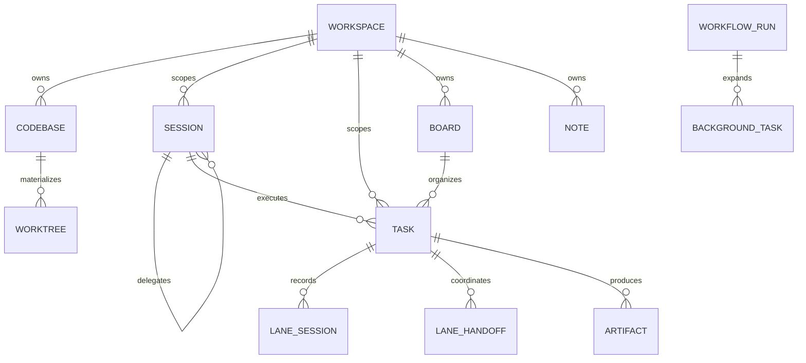
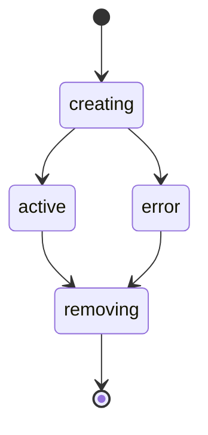
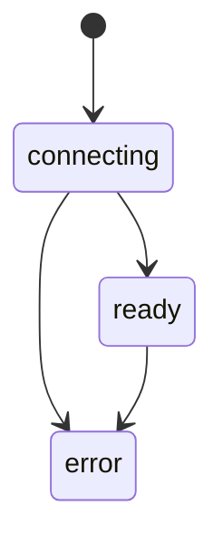
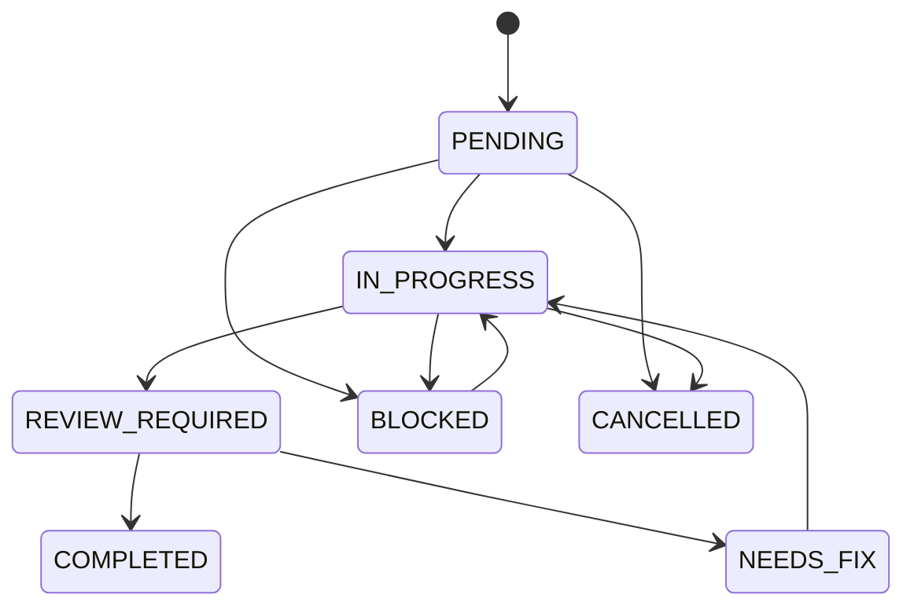
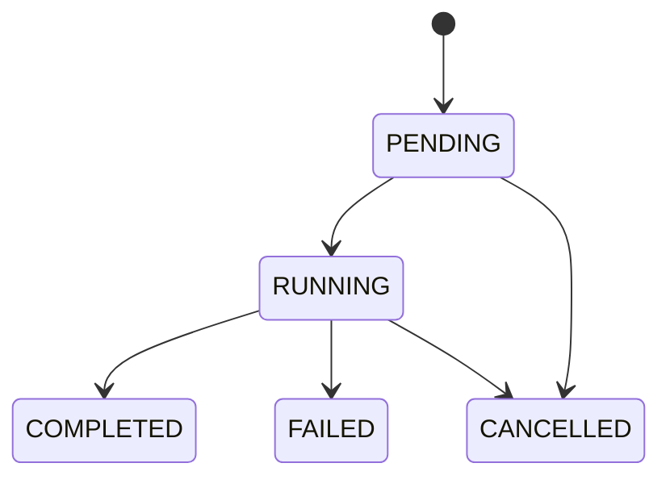

# 领域模型

## 1. 领域关系

## 2. Workspace

### Current

Workspace 具有 `active/archived` 状态和元数据。Codebase、Task、Session、Note、Board、Worktree 等都以 Workspace 为主要作用域。Workspace 元数据可给出 Worktree Root。

### Transitional

部分接口和启动路径在缺少 Workspace 时回退到 `default`。它是迁移兼容层，不是目标租户模型。

### Target

稳态资源操作必须显式提供 Workspace；只有初始化入口可创建或选择默认 Workspace。

## 3. Codebase 与 Worktree

Codebase 表示一个本地目录或 GitHub 来源，可选 Git 能力；一个 Workspace 可以拥有多个 Codebase，并指定默认项。

Worktree 表示独立分支工作目录，真实状态为：

Worktree 可关联 Session，但 Task 也可以持有 Worktree ID。交付检查必须优先解析 Task 的真实 Worktree，避免对 Bare Repo 直接执行工作区操作。

## 4. Session

Session 同时包含持久元数据和进程内运行状态：Workspace、CWD、Branch、Provider、Role、Specialist、Parent、Team Chain、逻辑 Agent ID、Provider-native Session ID、Execution Mode、Owner Instance 和 Lease。

Session 不是单一状态机，而是两层状态：

### ACP 连接态

### Activity 终态

运行活动另外记录 `completed/failed/timed_out` 以及 Runtime Release Reason。终态不等同于 ACP 连接态，因此界面和恢复逻辑必须结合两者判断。

### Target

可以在未来统一为更完整的生命周期模型，但迁移前必须保留连接态、活动终态和 Runtime Binding 的独立语义。

## 5. Team Run

Team Run 当前不是独立表。它由满足 Team Root 标识的顶层 Session、后代 Session、关联 Task 和产物推导。

Root 识别主要依据 Team Lead Specialist/ROUTA 语义与后代关系。`teamChainId` 只允许出现在顶层 Team Lead Session；子 Session 通过 `parentSessionId` 构成树。

删除 Team Run 必须按聚合视图解析其 Session、Task、Artifact、Background Task、Note、Worktree、Agent、Message 和 Trace，不能只删除 Root Session。

## 6. Task

Task 是独立于 Session 的持久工作单元，真实状态为：

状态之间的允许关系部分由 Column Mapping 和 Transition Policy 决定，而非仅由枚举定义。

Task 还承载：

- Board/Column/Position；
- Provider、Role、Specialist 和 Fallback Agent；
- `sessionIds` 与 `laneSessions`；
- Team Run 归属；
- Codebase/Worktree；
- GitHub 同步；
- Completion Summary、Verification Verdict/Report；
- JIT Context、Delivery Snapshot 和结构化证据。

### Task 的唯一工作身份

持久 Task 是 Team 与 Kanban 中唯一的工作实体，`Task.id` 标识工作，`Task.status` 标识生命周期。Session 是执行载体，Note 是文档，Artifact 是输入或证据；三者都不能通过标题、文本内容或显示位置反向推导为一个新 Task。

委派时必须先完成持久绑定，再启动执行：同一 Task 的委派串行化；重读并复用有效绑定；保存 `assignedTo`、`IN_PROGRESS`、`teamRunId` 和去重后的 Session 关系；只有保存成功后才激活 Agent、启动 Runtime 并发送 Prompt。这样用户看到的执行始终有可恢复的工作归属。

设计依据：[Team Task Lifecycle Consistency](../design-docs/team-task-lifecycle-consistency.md)。

## 7. Lane Session 与 Handoff

Lane Session 的真实状态为 `running/completed/failed/timed_out/transitioned`。它记录 Column、Step、Provider、Transport、Attempt、Loop Mode、Completion Requirement 和 Recovery 原因。

Lane Handoff 的状态为 `requested/delivered/completed/blocked/failed`，表达相邻 Lane 间的环境准备、上下文、澄清或重跑请求。

## 8. Background Task 与 Workflow Run

Background Task 负责在后台创建完整 Agent Session，真实状态为：

Workflow Run 状态为 `PENDING/RUNNING/COMPLETED/FAILED/CANCELLED`。当前 Workflow Run 的系统级 Store 是内存实现；Background Task 可持久化并引用 Workflow Run ID。

## 9. Note、Artifact 与 Trace

| 对象 | 职责 | 当前持久化 |
|---|---|---|
| Note | 协作知识、任务/报告树 | SQLite/Postgres/内存，实时通知进程内广播 |
| Artifact | Agent 间结构化交付与请求 | SQLite/Postgres/内存 |
| Trace | Session、Tool、文件和 VCS 证据 | 本地 JSONL；Serverless Postgres |
| Transcript | 面向恢复和用户阅读的会话历史 | Session History 与 Provider 记录组合 |

### Note 分类

- `spec` 表示规划或规范来源；
- `task` 只表示携带明确 Task 语义的兼容镜像；
- `general` 表示报告、研究、验证结果、交接和总结。

完成报告即使讨论某个 Task，也仍是 `general` Note。旧 Note 只有在带有明确 Task 关联、状态、层级或分配信息时，才能作为兼容节点进入任务树；禁止使用标题关键字推断身份。该约束避免“Task 已完成，但同名报告仍显示未开始”的双重投影。

### Artifact 分类

以下是目标领域契约；其中 Web 侧已实现的能力可视为 **Current**，专题文档仍标记为 `proposed` 的跨入口完整约束保持 **Target**，不能据此假设所有调用面已经一致。

Artifact 必须区分两种来源和用途：

| 类别 | 来源 | 是否计入交付证据 | 生命周期 |
|---|---|---:|---|
| Input Attachment | 用户在建 Task 时提供 | 否 | 与 Task 一起持久化和删除 |
| Evidence Artifact | Agent 或验证流程产生 | 是，受列 Gate 规则约束 | 随 Task 交付、审计和删除 |

附件写入成功必须意味着 Task 与全部附件均已耐久；自动执行只能在附件可读后开始。任一附件失败时，不能遗留 Task、Artifact、外部 Issue、事件或 Agent Run。附件内容属于不可信输入，不能成为系统策略，也不能被执行、拼接为路径或写入日志。

Team Run 启动时的一次性本地文件输入属于首轮 Prompt 内容，不创建合成 Task 或 Artifact，不与 Kanban Task 附件生命周期混用。

设计依据：[Report Note Classification](../design-docs/team-report-note-task-tree-classification.md)、[Kanban Task Input Attachments](../design-docs/kanban-task-input-attachments.md)。

## 10. 关键不变量

- Parent/Child Session 不能形成环。
- Team 后代必须与 Root 属于同一 Workspace。
- Task 的 Board、Codebase 和 Worktree 必须属于同一 Workspace。
- Provider-native Session ID 不能代替逻辑 Agent ID。
- Lane Session 是历史记录，新的重试不应覆盖旧 Attempt。
- Verification Verdict 和 Delivery Evidence 应与 Task 一起持久化。
- Task 是唯一工作身份；Session、Note 和 Artifact 只能引用或投影 Task。
- Team Run 归属使用 `task.teamRunId`；Session 历史字段不能被解释为资源所有权。
- Input Attachment 不得计入 Evidence Gate。

[返回目录](./README.md)
