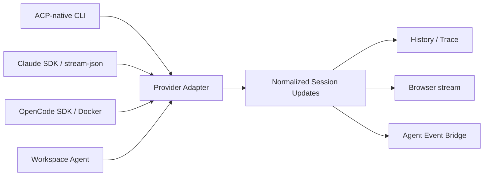
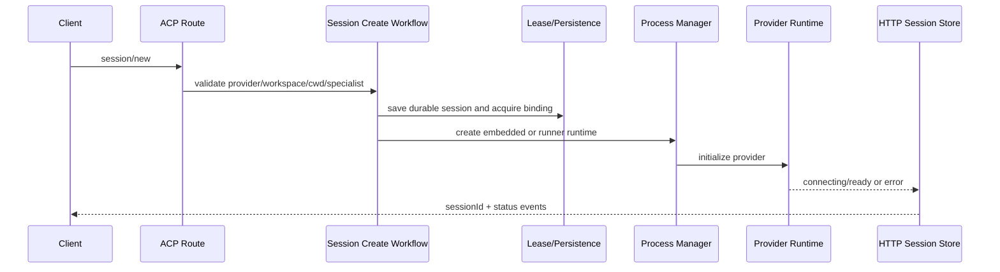
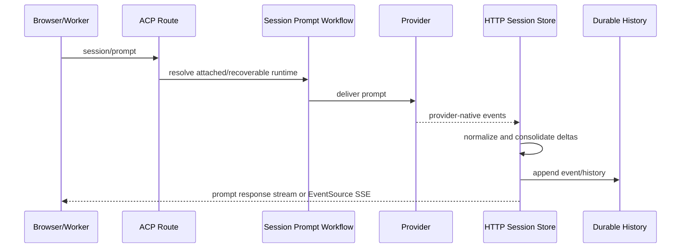
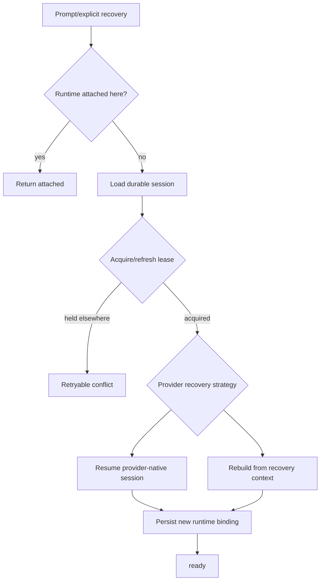

# Agent Session 与协议

## 1. 协议分工

| 协议 | 当前职责 |
|---|---|
| REST | 产品资源 CRUD、管理和查询 |
| ACP | Session 创建、Prompt、进程/容器管理和流式通知 |
| MCP | Agent 调用协作 Tool |
| SSE | ACP、Kanban、Notes、Clone 等单向增量推送 |
| A2A | 外部 Agent Transport 和认证头配置 |
| A2UI | Dashboard/Canvas 结构化 UI 表面 |

ACP 管“Agent 会话如何运行”，MCP 管“Agent 能调用哪些平台能力”，二者不得混为一套权限或状态模型。

## 2. Provider 架构

### Current

Provider Registry 支持静态 Preset、动态注册、复合模型 ID 和 Model Tier。已存在 OpenCode、Docker OpenCode、Gemini、Codex、Copilot、Auggie、Kimi、Kiro、Qoder、Claude 和 Workspace 等 Preset。

Provider 差异没有完全消失。进程启动、认证、模型参数、原生恢复、Permission 和 Docker 配置仍由各 Provider 分支处理；“Provider 无关”表示上层事件语义尽量统一，而非完全相同能力。

## 3. Session 创建链路

创建路径还负责 Specialist Prompt、MCP 配置、Sandbox、Team Chain 校验、Model 和 Tool Mode。

## 4. Prompt 与流式链路

同一 Session 在 Prompt Response Stream 与持久 EventSource 间有防重复模式。消息块会合并，以限制历史膨胀；每条 Notification 尽量带 Event ID。

## 5. History 幂等

Session Store 提供 `appendHistoryOnce(sessionId, eventId)`，原子区分：

- appended；
- duplicate；
- session_not_found。

该机制用于 Prompt 与 Child Report 的重试确认。它不是通用 Inbox，但已经提供关键交付事件的耐重试基础。

## 6. Session Lease 与 Runtime Binding

### Current

持久 Session 保存 `executionMode/ownerInstanceId/leaseExpiresAt`。Store 使用条件更新尝试取得过期 Lease，避免两个实例同时恢复同一 Session。

Lease 主要覆盖 Session Runtime，不覆盖 Background Task Queue。Lease 失败需要重新读取，区分同实例附着、其他实例持有和 Session 不存在。

## 7. Runtime Finalization

Finalizer 在释放进程前执行缓冲、Trace、History 和 Provider Recovery 信息持久化。若 Completed Session 的 History 尚未耐久，或 Claude 类 Runtime 没有可恢复 Native ID，Finalizer 可以拒绝释放，留待后续清理。

这使“Session 已完成”与“Runtime 可安全回收”成为两个不同判断。

### 持久对象与可替换 Runtime

| 层次 | 必须稳定的身份/状态 | 可以重建的运行资源 |
|---|---|---|
| Team/Agent | Root、父子关系、逻辑 Agent ID、Task 归属 | 进程、容器、流连接 |
| Session | Loom Session ID、Provider、Workspace、恢复上下文、历史 | Provider 客户端实例 |
| Provider | Provider-native Session ID 或恢复令牌 | 本地 SDK/CLI 进程 |

逻辑 Agent ID 与 Provider-native Session ID 必须分别持久化：前者回答“谁在团队中负责”，后者回答“怎样续接供应商会话”。Runtime 丢失不应创建第二个逻辑 Agent，也不能覆盖原 Session 树。

恢复设计优先复用现有 Session 持久化、Provider Adapter、Lease 和 Finalizer，不新增第二套调度器、事件溯源或血缘表。该收敛方向来自 [Team Session Runtime Recovery](../design-docs/team-session-runtime-recovery.md)，其尚未落地部分应按 **Target** 管理。

## 8. Session 恢复

恢复上下文包含 Workspace、Team、Task、Kanban、Specialist、Provider 和历史摘要。Provider 能力不同，因此恢复结果可能是原生续接，也可能是新 Runtime 加恢复 Envelope。

## 9. MCP Tool Boundary

### Current

MCP 有 `coordination/kanban-planning/team-coordination` Profile。Planning Profile 使用 Allowlist，并禁止通过通用 `update_task` 修改 Status、Column、Dependency、Completion、Verification 和 Assignment 等高风险字段。

Task Lane 流转应使用 `move_card`，证据应使用 Artifact Tool；这避免 Planning Agent 绕开 Gate。

MCP Request Body 有 8 MiB 上限，大结果应通过 Artifact 或文件传递。

### Limitation

Profile 和 Write Boundary 不是完整用户授权。它们限制 Agent Tool 面，但不能替代 API 身份、Workspace ACL 和 Sandbox。

## 10. Target

- 为所有关键事件定义明确 Sequence/Cursor 契约。
- 将 Provider Capability Discovery 写入 Session 创建响应。
- 统一 Permission/AskUserQuestion 的持久恢复语义。
- 独立 Runner 前，将 Session Lease 与 Runner 心跳、Job Claim 明确分层。
- 为每类 Provider 定义“原生恢复、上下文重建、不可恢复”的能力声明和资源释放上限。

[返回目录](./README.md)
