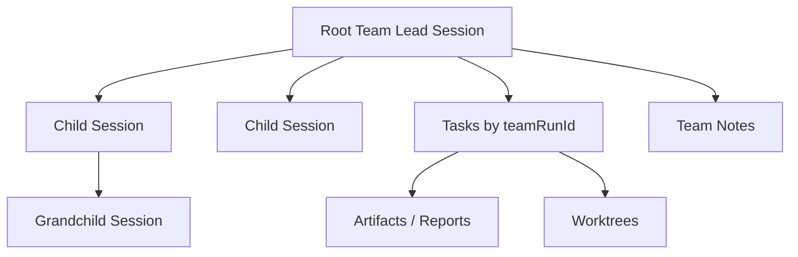
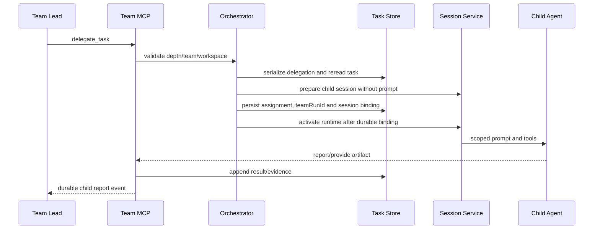
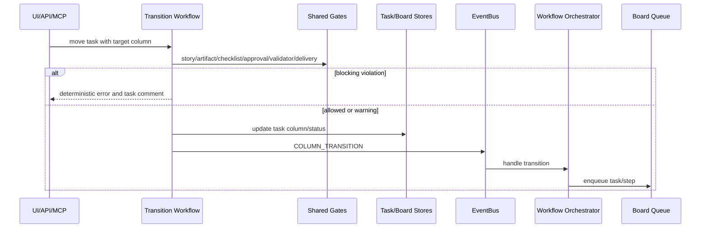
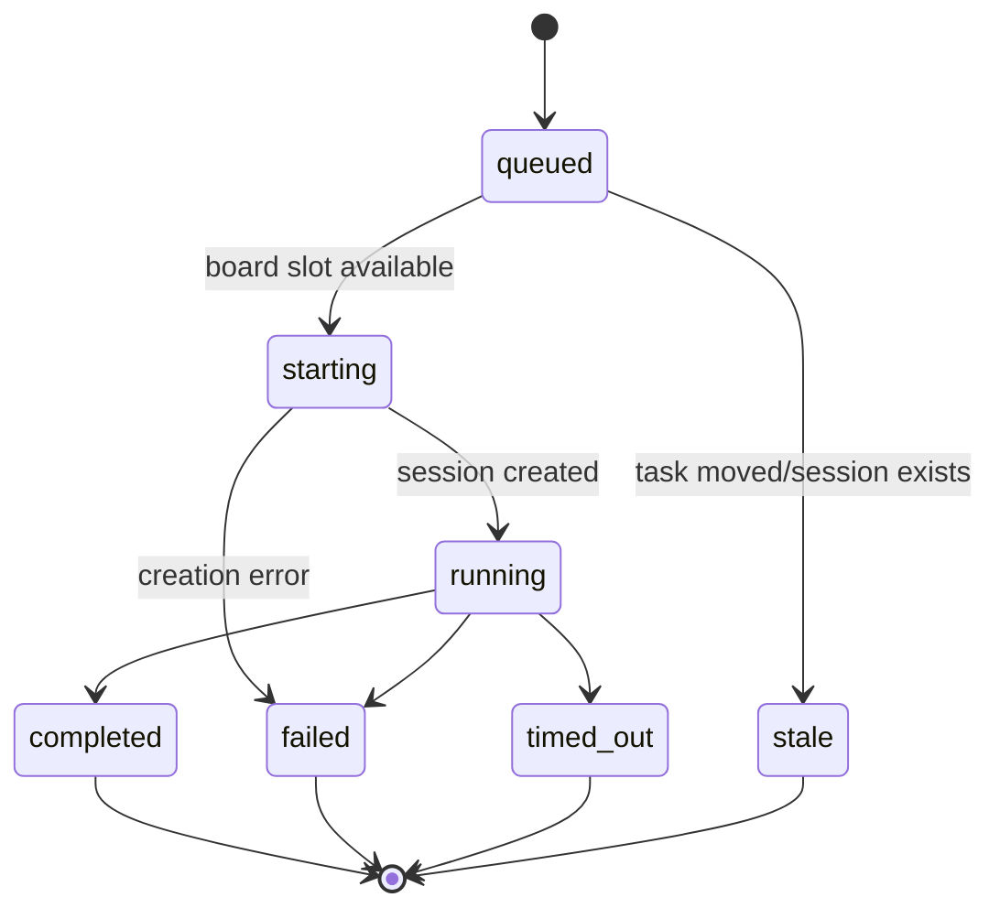
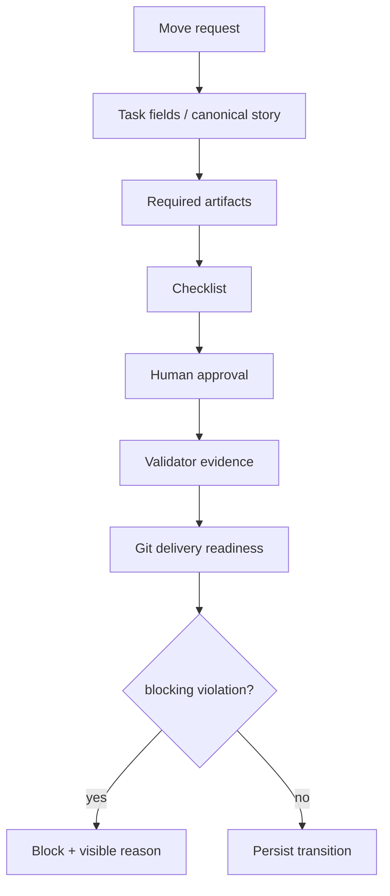

# Team 与 Kanban 编排

## 1. Team Run 语义

Team Run 是聚合视图：Root Team Lead Session、后代 Session、Team Chain、`teamRunId` Task、Notes、Artifacts、Background Tasks 和 Worktrees 共同构成一次 Team 执行。



Team Root 主要以顶层 Team Lead/ROUTA 标识及后代关系识别。Team Chain 只属于 Root，缺省值兼容 Legacy Full Delivery。

Team 模式固定由 Team Lead 协调。执行链在创建时选择 `lightweight`、`standard_delivery` 或 `full_delivery`，决定是否引入规划、开发、评审和验证等角色；Root 仍可承担一个 Specialist 职责。链路选择属于 Team Run 的启动契约，不在运行中切换。

## 2. 委派链路



Team Runtime Binding 可以从持久 Session 树重建 Lead 和后代映射。缺少逻辑 Agent ID 的后代不能被静默注册为完整 Team。

委派的关键顺序是“先绑定、后执行”。如果 Agent/Session 创建或 Task 保存失败，必须停止新 Runtime 并把 Agent 标为错误；如果持久绑定已完成但首次 Prompt 启动失败，应在确认 Task 仍归该执行者后将 Task 转为 `BLOCKED`。这一顺序保证恢复、UI 和删除规划看到同一份责任关系。

## 3. Team Report

Child Report 使用稳定 Delivery ID 和 Session History 的原子追加一次，避免重试产生重复报告。最终 Team Report 应落为明确的 `general` Note 或 Evidence Artifact，而非只依赖聊天可见文本，也不能作为未绑定的 task Note 进入任务树。

## 4. Team Run 删除

```mermaid
sequenceDiagram
  participant U as User
  participant A as Team Run API
  participant P as Deletion Planner
  participant R as Runtime Manager
  participant D as Persistent Stores
  participant F as Local Files
  participant K as Kanban SSE

  U->>A: preview delete
  A->>P: resolve root, descendants and owned resources
  P-->>U: deletion plan
  U->>A: confirmed delete
  A->>R: stop every active runtime
  alt any runtime cannot stop
    A-->>U: fail; delete nothing
  else all stopped
    A->>D: transaction/batch aggregate deletion
    A->>F: best-effort local session cleanup
    A->>K: notify boards
    A-->>U: deletion summary
  end
```

持久模式优先使用数据库 Transaction/Batch；本地 Session 文件清理属于后置最佳努力。删除的安全不变量是：若活跃 Runtime 无法全部停止，则不删除领域数据。

资源归属按以下优先级解析：

下列规则来自 `proposed` 专题设计。与当前删除规划器一致的部分属于 **Current**，共享资源判定和所有入口完全统一等尚未核验部分属于 **Target**。

1. `task.teamRunId` 是 Task 归属的权威字段；
2. Root Session 及其真实后代属于该 Team Run；
3. `sessionId`、`triggerSessionId`、`sessionIds` 和 `laneSessions` 是执行历史，不是所有权证明；
4. 缺少显式归属的旧数据只能通过 Session 树保守推断；若资源还被 Team Run 外的活动 Session 引用，则保留；
5. 预览与确认删除必须使用同一份删除计划，避免两次解析产生不同集合。

设计依据：[Team Run Deletion Ownership Boundaries](../design-docs/team-run-deletion-ownership-boundaries.md)。

## 5. Kanban Column Policy

Column 可配置 Stage、ACP/A2A Transport、Automation Steps、Provider、Role、Specialist、Artifacts、Task Fields、Contract、Delivery、Checklist、Human Approval、Validator、Gate Mode、History Memory 和 Dev Supervision。

推荐 Stage 为 `backlog/todo/dev/review/blocked/done`，但自定义列通过 Stage 语义参与状态映射。

## 6. 列迁移链路



REST Task 更新与 MCP `move_card` 应使用相同 Delivery Readiness 和 Policy Evaluator。Prompt 只解释规则，服务器判断才是权威。

## 7. Board Session Queue

### Current

Queue 按 Board 维护运行项和等待项，并使用 Board 并发限制。启动前会检查：

- Task 是否仍在目标 Column；
- 是否已有 Session 或 Lane Session；
- Queue 条目是否陈旧；
- 当前 Step 是否仍需要执行。

Session 完成或失败后释放 Board 槽位，推进下一项。Queue 主要是进程内协调状态，Task 的 Lane Session 历史提供持久证据。



上述 Queue 状态是编排语义；持久 Task Lane Session 使用 `running/completed/failed/timed_out/transitioned`。

## 8. 多步 Lane

Column Automation Steps 按顺序执行。每一步可以指定 Transport、Provider、Role 和 Specialist。下一 Step 应在前一步满足 Completion Requirement 后开始，并将前序 Session/Handoff/Artifact 作为上下文。

Dev Supervision 可使用 watchdog retry 或 Ralph loop，并记录 Attempt、Recovery Reason 和 `recoveredFromSessionId`。

## 9. Gate 顺序



Delivery Rules 当前支持：Committed Changes、Clean Worktree、PR-ready。Task 可以保存 Delivery Snapshot，以避免 PR/Merge/Base Sync 后证据消失。

## 10. Team Timeline 收敛链路

Team 页面同时展示 Root 与多个 Child Transcript。Root 使用 SSE 作为低延迟主链路；页面可见时，以低频批量刷新 Root 和已知后代作为一致性兜底，隐藏页面暂停刷新，重新聚焦时立即收敛。轮询快照不得覆盖请求发出后到达的更新流，可通过 Root 更新代次或服务端顺序号拒绝陈旧响应。

时间线自动跟随由用户是否接近底部决定，而不是由消息条数决定；Child Lane、工具结果或 Markdown 改变实际渲染高度时也必须生效。该交互链路不改变 Session 持久化或 ACP 所有权，详见 [Team Timeline Live Refresh](../design-docs/team-timeline-live-refresh-and-auto-follow.md)。

## 11. Current Limitations 与 Target

### Current Limitations

- Queue 与 Orchestrator 主要依赖单进程状态。
- Task 更新、事件发布和 Queue 入队没有通用数据库 Outbox。
- 某些复杂 Gate 的证据依赖 Task Comment/Report 文本结构。

### Target

- 多实例前将 Transition Event 通过 Outbox 持久化。
- 为 Lane Job 建立持久唯一键和 Claim Lease。
- 将 Gate Result 结构化存储，减少文本证据解析。
- 保留 Team Run 聚合视图，不为方便查询而复制一套相互漂移的 Team 状态。

[返回目录](./README.md)
