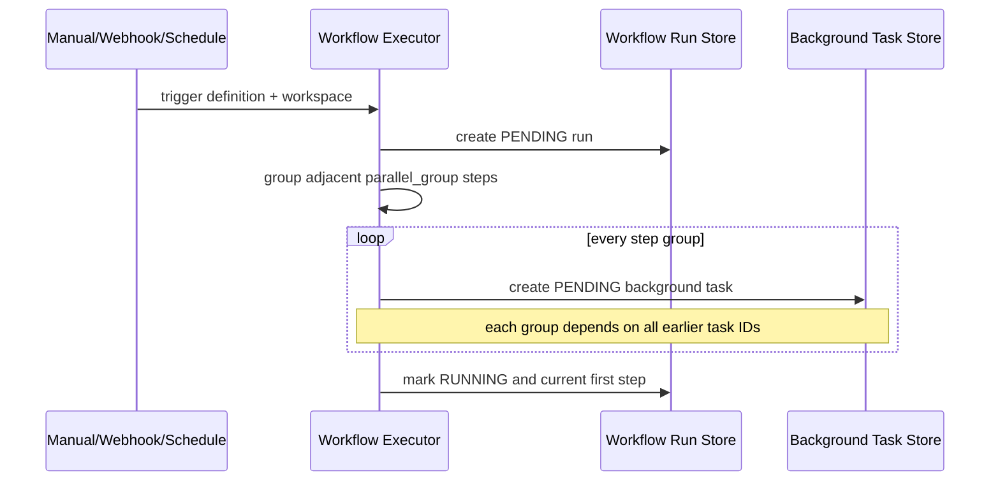
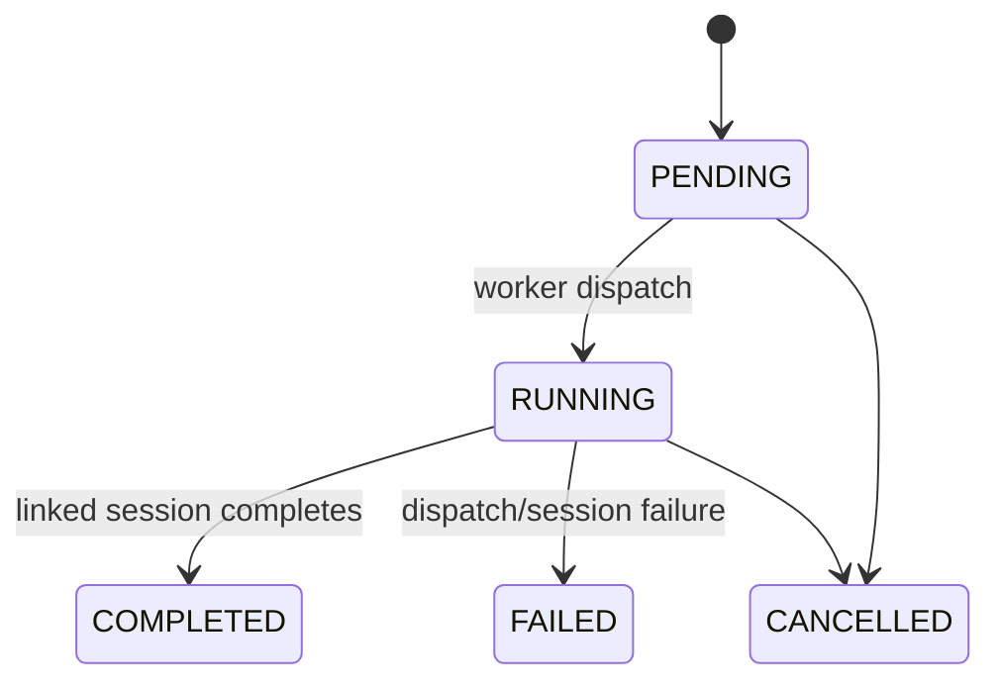
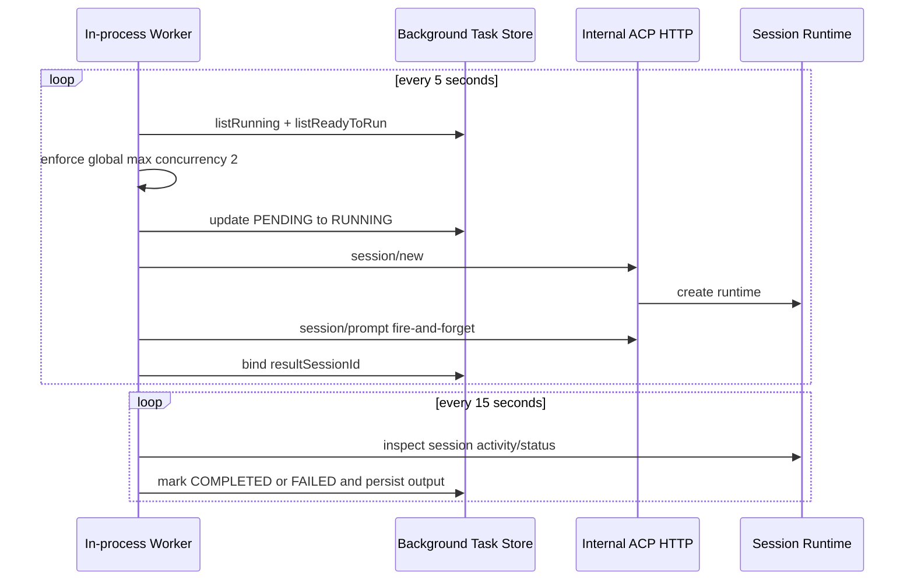
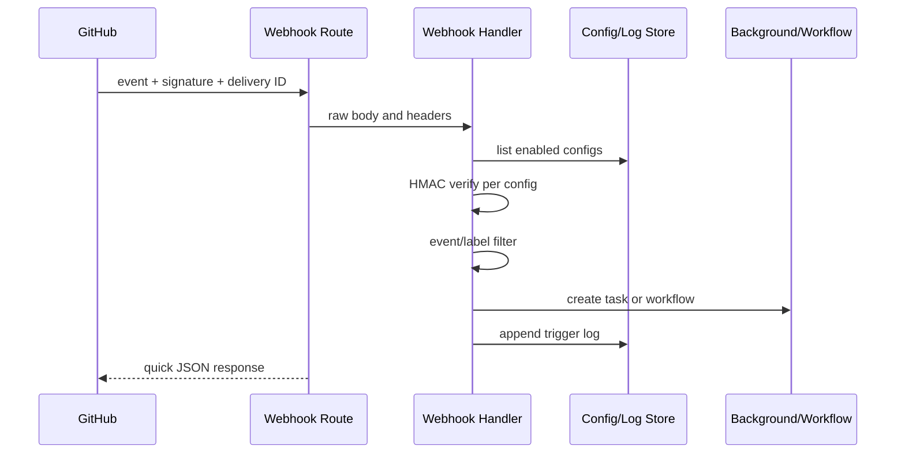

# Workflow 与后台执行

## 1. 两种 Task

| 类型 | 语义 |
|---|---|
| Domain Task | Team/Kanban 中的持久工作单元，可由多个 Session 接力 |
| Background Task | 在后台启动完整 ACP Session 的异步执行作业 |

二者不能混用。Background Task 可以关联 Workflow Run，也可以由 Schedule、Webhook、Polling 或手工触发。

## 2. Workflow Definition

Workflow 从 YAML 加载，包含 Name、Version、Trigger、Variables 和 Steps。Step 支持 Specialist、Adapter、Config、Input、Actions、Output Key、Condition、Parallel Group、Failure Strategy、Retry 和 Timeout 等声明。

### Current Reality

执行器主要使用 Step Name、Specialist、Input、Parallel Group 和依赖输出。`if/on_failure/max_retries/timeout_secs/output_key` 等声明并不都形成完整运行语义，详细文档必须把它们视为部分实现，而不是保证。

## 3. Workflow 展开

当前依赖构建是“每个新 Group 依赖此前创建的全部 Task”，而不是任意 DAG 定义。相同 `parallel_group` 只有相邻出现时才会组成同组。

## 4. Background Task 状态

Background Task 存储 Attempts/MaxAttempts，但当前 Worker 不构成完整的 Retry State Machine。

## 5. Worker 链路

### Current Limitations

- PENDING → RUNNING 不是显式数据库 Claim Lease，多个 Worker 可能竞争。
- `sessionToTask` 是进程内 Map，重启后主要依赖 `resultSessionId` 数据恢复。
- Worker 使用内部 HTTP 调用自身 ACP API，继承完整 Session 创建语义，也继承 Base URL 和网络故障面。
- 最大并发固定为 2，不按 Workspace、Provider 或优先级做公平调度。

## 6. 依赖输出

Worker 在运行 Workflow Step 前，将 `${steps.<name>.output}` 替换为已完成 Background Task 的 `taskOutput`。无法解析的引用会使该 Task Dispatch 失败，而不是以空值继续。

完成后，Assistant Output 作为 Step Output 写回 Background Task，并尽力更新 Workflow Run。

## 7. Workflow Run 持久化缺口

### Transitional

SQLite/Postgres Schema 均有 Workflow Run 表结构，但系统装配在所有模式下使用 In-memory Workflow Run Store。结果是：

- Background Task 可以保留 `workflowRunId`；
- 服务重启后 Workflow Run 元数据和 Step Output 聚合丢失；
- Webhook/Schedule Workflow 的整体状态无法可靠恢复。

这是首要数据一致性缺口之一。

## 8. Scheduler

本地常驻 Node 使用进程内 Cron 每分钟执行 Schedule Tick；Vercel 生产由外部 Cron 请求 Tick API。Schedule Store 负责持久化计划，但多实例安全依赖 Tick 内部的到期查询和更新时间，尚未形成通用 Claim Lease。

## 9. GitHub Webhook

当前 Secret 为空时会接受未签名请求，适合作为开发便利，不适合公网默认值。Delivery ID 会返回和记录日志语境，但没有作为强制幂等键；重复事件可能重复创建任务。

Route 在内部异常时仍返回 200，以避免 GitHub 重试。这减少重试风暴，也意味着失败必须依赖 Trigger Log 和人工/内部补偿处理。

## 10. Polling

GitHub Polling 是本地没有 Webhook 时的替代触发方式，并对 API Rate Limit 做检查。Polling 和 Webhook 都应只创建 Background Task，不在触发请求中等待 Agent 完成。

## 11. Target 演进

优先顺序：

1. 实现 Postgres/SQLite Workflow Run Store 并正式装配。
2. 为 Background Task 增加原子 Claim、Lease Token、Heartbeat 和 Recovery Scan。
3. 使用 Delivery ID/Webhook Config 构成 Inbox 去重键。
4. 将 Worker 对 ACP 的内部 HTTP 调用下沉为共享 Session Application Service。
5. 补齐 `on_failure/retry/timeout/condition` 的真实运行语义。
6. 多实例前引入 Outbox 和共享 Worker Queue。

[返回目录](./README.md)
