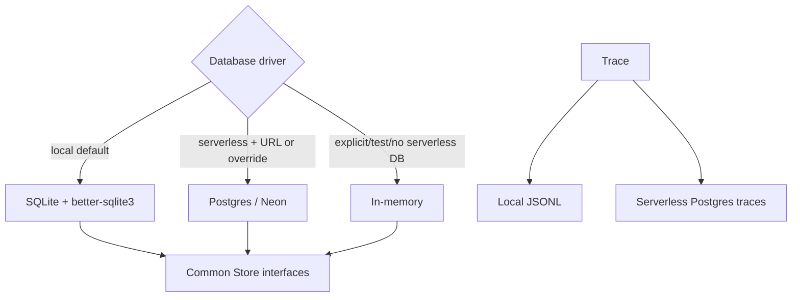
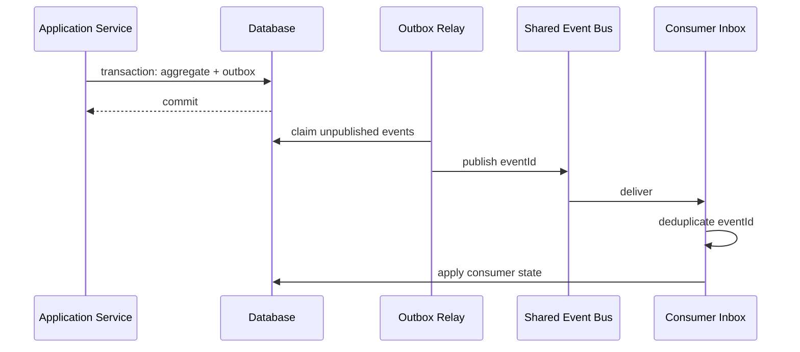

# 数据与一致性

## 1. 数据介质

本地即使存在云数据库 URL，也默认选择 SQLite，除非显式要求 Postgres。这避免云数据库休眠影响本地 Session History。

## 2. Store 覆盖

| 领域 | SQLite | Postgres | Memory | 备注 |
|---|---:|---:|---:|---|
| Workspace/Codebase/Worktree | 是 | 是 | 是 | Workspace-first 基础 |
| Agent/Conversation/Task | 是 | 是 | 是 | Task 含复杂 JSON 字段 |
| Note/Kanban/Artifact | 是 | 是 | 是 | Note 实时通知另属进程内 |
| Background Task/Schedule | 是 | 是 | 是 | Worker 状态仍有进程内部分 |
| ACP Session/History | 是 | 是 | 是 | 独立 Session Store 与 Lease |
| Workflow Run | 表存在，未装配 | 表存在，未装配 | 是 | 当前运行统一用内存 Store |
| Permission Request | 否 | 否 | 是 | 进程内 Map |
| Trace | JSONL | Serverless 表 | 内存/JSONL | SQLite 无独立 Trace 表 |

## 3. SQLite 降级

SQLite 模块加载失败时，系统会回退到内存 Store 并保持应用可用。该行为适合构建兼容和测试，但有数据丢失风险。

### Target

- 开发环境允许明确的告警降级。
- 生产和 Docker 持久模式应 fail closed，或在 Readiness 中标记为不可服务。
- 使用 Capability Descriptor 表示每个领域是否持久，而不是单一 `isPersistent`。

## 4. Session 数据一致性

Session Store 已具备两项关键原子能力：

1. `appendHistoryOnce`：按 Event ID 幂等追加。
2. `tryAcquireExpiredLease`：按 Owner/Expiry CAS 获取 Runtime Lease。

Runtime Binding 更新只修改 Provider Session ID、Execution Mode、Owner 和 Lease，避免覆盖 History、Agent ID 和其他持久字段。

## 5. Task 乐观锁

MCP `update_task` 暴露 `expectedVersion`，Task 更新路径存在乐观锁语义。详细架构不应声称所有聚合都已经统一 Version；Board、Workflow 和其他 Store 仍需逐项核实与收口。

## 6. Team Run 删除一致性

聚合删除先生成 Plan，再停止所有活跃 Runtime。只有全部停止成功才进入数据删除。

- Postgres：根据驱动使用 Batch 或 Transaction。
- SQLite：同步 Transaction 删除关联行。
- Memory：按 Store 顺序删除。
- Local Session File：事务后最佳努力删除。
- Kanban Event：删除后通知界面。

该流程优先避免“数据已删除但 Agent 仍运行”。本地文件清理失败可能留下残留，但不会破坏领域数据一致性。

## 7. 当前事件一致性

EventBus、Kanban Broadcaster 和 Note Broadcaster 主要是进程内发布。Task/Board 更新与事件通知并非统一数据库事务，因此存在状态已提交但自动化事件丢失的窗口。

SSE 事件主要用于通知。ACP History 有 Event ID 和 `afterEventId` 能力，但 Kanban/Notes Broadcaster 没有同等级的持久 Cursor Replay。

## 8. 当前一致性模型

| 操作 | 当前保证 | 缺口 |
|---|---|---|
| Session History Delivery | Event ID 原子幂等 | 仅覆盖指定 History 事件 |
| Session Runtime Recovery | CAS Lease | 依赖持久 Store 和时间语义 |
| Task 更新 | 部分路径乐观锁 | 未形成所有聚合统一规范 |
| Team Run 删除 | Runtime-first + DB transaction | 本地文件后置最佳努力 |
| Kanban Transition | 共享 Gate + Store 更新 + 进程事件 | 无 Outbox |
| Workflow | Background Task 持久，Run 内存 | 重启后整体状态丢失 |
| Permission | 进程内幂等 Response | 重启丢失 |
| Webhook | HMAC + Trigger Log | 无 Delivery ID Inbox 去重 |

## 9. Target 一致性架构

引入顺序：

1. 先持久化 Workflow Run 和 Permission。
2. 再为 Background Task 建立 Claim Lease。
3. 多实例前为 Kanban Transition 和 Schedule/Webhook 引入 Outbox/Inbox。
4. 不要为单实例本地模式过早引入独立消息平台；Postgres Outbox 足以作为第一步。

## 10. 数据生命周期

### Current

Session History 有内存保留上限和清理；Trace 按本地日期/Session 写文件；Team Run 删除会清理主要关联数据。

### Target

需要明确：

- Session Event 压缩与归档周期；
- Trace、Transcript 和 Artifact 的不同保留策略；
- Workspace Archive 与 Hard Delete；
- Orphan Worktree/Session File 垃圾回收；
- Postgres Migration 与 SQLite Schema Parity 检查。

[返回目录](./README.md)
