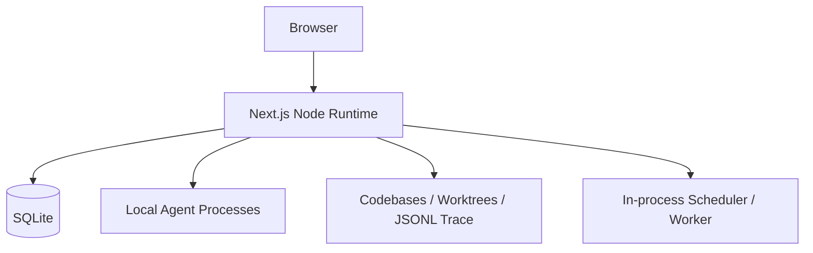
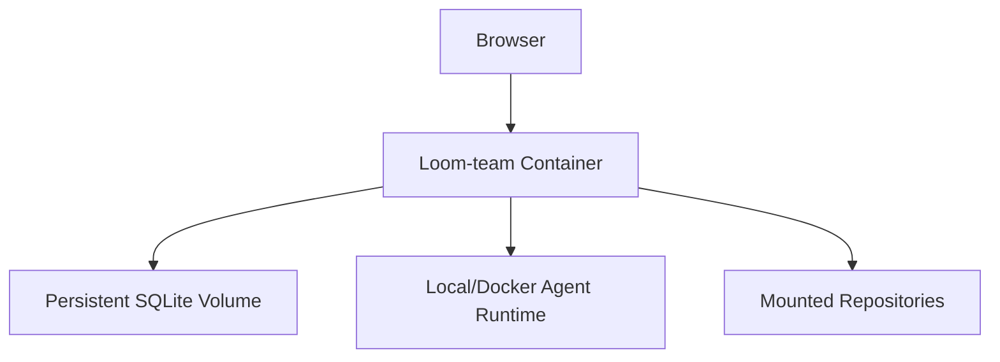
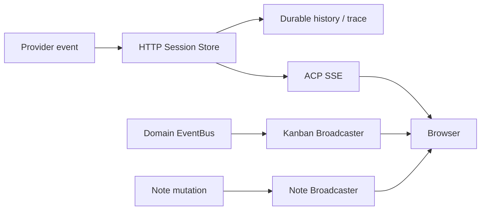
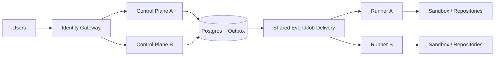

# 部署、可靠性与可观测性

## 1. 本地模式

这是当前最完整、最自然的运行形态。本地文件、Git、Agent CLI 和 SQLite 都在同一主机，延迟和配置成本最低。

## 2. Docker 单实例

默认 Compose 使用 SQLite Volume，也可以启用 Postgres Profile。应用健康检查目前主要验证 HTTP Liveness，不验证数据库、Worker、Provider 或持久化降级。

## 3. Postgres 单实例

Postgres 适合团队共享和生产持久化，但不能自动消除进程内状态：Workflow Run、Permission、SSE Controller、EventBus 和 Worker Map 仍可能与 Node 实例绑定。

## 4. Serverless

### 可用部分

- Next.js 页面与普通 API；
- Postgres Store；
- Vercel Cron Tick；
- Trace 写 Postgres；
- 短请求型管理能力。

### 结构性张力

- Agent 子进程和 Docker；
- 长时间 Prompt Stream/SSE；
- 进程内 Scheduler 和 Worker；
- 本地 Repository/Worktree；
- `globalThis` Runtime 与 Broadcaster；
- 本地文件资产。

因此 Serverless 更适合作为未来 Control Plane，而不是当前完整 Agent Runtime 的首选生产形态。

## 5. 当前实时架构

ACP、Kanban、Notes、Clone Progress 和 MCP 有流式 Route。Broadcaster Controller 是进程内对象；多实例下事件发生实例与连接实例可能不同。

## 6. Session 可靠性

当前已有：

- Durable Session Metadata；
- Provider-native Session ID；
- Runtime Binding；
- CAS Session Lease；
- History Event ID 幂等；
- Session Write Buffer；
- Runtime Recovery；
- Runtime Finalizer；
- Notification Retention；
- Team Runtime Binding 恢复。

这些机制主要解决 Session 长任务，不等于 Background Task、Workflow 和所有领域事件都达到同等可靠性。

## 7. Background/Workflow 可靠性

主要缺口：

- Background Task 无数据库 Claim Lease；
- Workflow Run 内存化；
- Worker 进程重启后需要重新扫描 Session 关系；
- 自身 HTTP 调用存在配置/网络故障面；
- 多实例可能重复 Dispatch；
- Retry/Timeout/OnFailure 声明未形成完整执行闭环。

## 8. Trace 与 Telemetry

| 信号 | 当前用途 |
|---|---|
| Business Trace | Session、Message、Tool、File 和 VCS 审计 |
| Transcript/History | 用户阅读、恢复和消息重放 |
| OpenTelemetry | Scheduler、Worker 和 Runtime Span；按环境开启 |
| Runtime Logs | 诊断初始化、Provider、DB 和 Worker |

本地 Trace 按 Workspace/CWD Slug、日期和 Session 写 JSONL；Serverless + Postgres 时写 Trace Store。Trace 写失败通常不阻断 Agent 主流程，因此必须监测丢失。

## 9. 健康模型

### Current

`/api/health` 是 Liveness，只返回进程存活。

### Target

| 端点/维度 | 检查 |
|---|---|
| Liveness | Node Event Loop 和 HTTP |
| Readiness | Database、Migration、Store Driver、Runtime Services |
| Capability | Provider、Git、Docker、Filesystem |
| Degradation | SQLite→Memory、Worker Disabled、Trace Failure |

## 10. Control Plane / Runner Target

拆分前置条件：Workflow/Permission 持久化、Background Claim Lease、Runner 身份、Job Token、共享事件、Artifact 传输和 Repository 定位。

## 11. 推荐演进顺序

1. 强化单实例 Readiness 和降级可见性。
2. 持久化 Workflow Run 与 Permission。
3. 为 Background Task 增加 Claim/Heartbeat/Recovery。
4. 引入 Postgres Outbox/Inbox。
5. 再分离 Runner；不要先拆服务再补状态语义。

[返回目录](./README.md)
