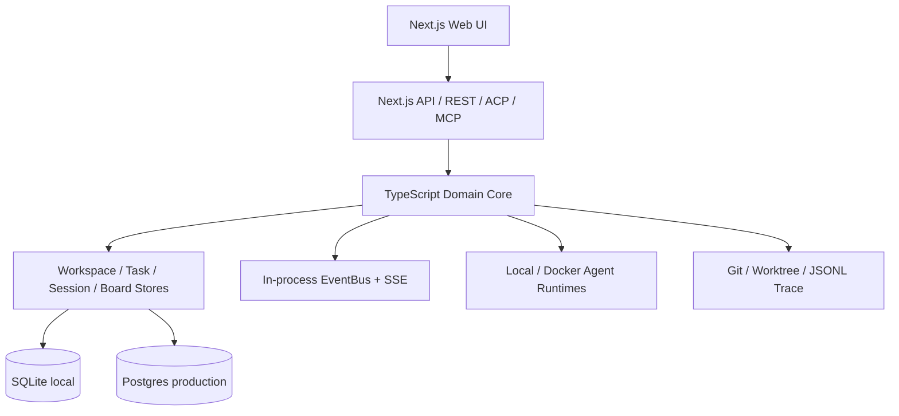

# Loom-team 详细架构

本目录是 `docs/ARCHITECTURE.md` 的详细展开。它以现有架构、ADR 和专题设计文档为输入，将分散的已决策内容组织成可用于开发的软件架构书；不另立一套与原文竞争的事实来源。

## 文档权威层级

| 层级 | 职责 | 冲突处理 |
|---|---|---|
| [Canonical Architecture](../ARCHITECTURE.md) | 稳定边界、运行拓扑、领域职责和全局不变量 | 最高层系统约束 |
| [ADR](../adr/README.md) | 已接受且需要长期保留的架构决策及其理由 | 专题实现必须服从 ADR |
| [Design Docs](../design-docs/index.md) | 某一能力的设计意图、状态、失败语义和验收边界 | 按文首状态区分 accepted、proposed 和 historical |
| 本详细架构书 | 跨专题整合、端到端链路、质量属性和演进路线 | 发现冲突时回到上层文档修正，不自行覆盖 |
| [Implementation Mapping](./implementation-mapping.md) | 架构概念到实现区域的核验入口 | 仅用于追踪落地，不定义架构 |

专题设计仍在讨论时，本架构书只把它标为 **Target/Open**；只有已经接受且与当前运行事实一致的内容，才能写成 **Current** 架构不变量。

## 状态标记

| 标记 | 含义 |
|---|---|
| **Current** | 当前运行时已经具备并使用的行为 |
| **Transitional** | 已存在部分能力，但仍有默认回退、内存状态或语义未收口 |
| **Target** | 建议的目标架构，不应被理解为当前能力 |
| **Open** | 需要产品、架构或安全负责人确认 |

## 架构摘要

**Current**：Loom-team 是 Workspace-first、Web-only 的模块化单体。Agent 主要由同一 Node 运行面管理；SQLite 服务本地开发，Postgres 服务生产持久化；实时协作依赖 SSE 和进程内事件。

**Transitional**：部分路径仍使用默认 Workspace；Workflow Run 与 Permission 仍含进程内状态；实时广播和后台 Worker 以单实例为主要假设。

**Target**：持久化 Workflow/Permission/Task Claim，引入 Outbox 与共享事件，在需要横向扩展时分离 Control Plane 与 Agent Runner。

## 文档导航

1. [系统总览](./01-system-overview.md)
2. [领域模型](./02-domain-model.md)
3. [Agent Session 与协议](./03-agent-session-and-protocols.md)
4. [Team 与 Kanban 编排](./04-team-and-kanban-orchestration.md)
5. [Workflow 与后台执行](./05-workflow-and-background-execution.md)
6. [数据与一致性](./06-data-and-consistency.md)
7. [安全与权限](./07-security-and-permissions.md)
8. [部署、可靠性与可观测性](./08-deployment-reliability-observability.md)
9. [质量属性与演进](./09-quality-attributes-and-evolution.md)
10. [实现映射](./implementation-mapping.md)

## 推荐阅读路线

- 快速理解：README → 系统总览 → Team 与 Kanban。
- Agent Runtime：系统总览 → Session 与协议 → 数据与一致性。
- 可靠性：Workflow → 数据与一致性 → 部署与可靠性。
- 安全上线：安全与权限 → 部署 → 质量属性。

## 术语

| 术语 | 定义 |
|---|---|
| Workspace | 用户可见的最高资源作用域 |
| Session | 一次持久可恢复的 Agent 对话/执行线程 |
| Team Run | 由 Root Session、后代 Session 与关联资源组成的聚合视图 |
| Task | 独立于 Session 的持久工作单元 |
| Lane Session | Task 在某一 Kanban Column 中的一次执行记录 |
| Background Task | 脱离浏览器请求、负责启动完整 ACP Session 的异步作业 |
| Workflow Run | Workflow Definition 的一次执行，目前存在持久化缺口 |
| ACP | Agent Session 创建、Prompt 和运行事件协议 |
| MCP | Agent 调用 Loom-team 协作能力的 Tool 协议 |

## 文档关系

- 稳定原则：[Canonical Architecture](../ARCHITECTURE.md)
- 架构决策：[ADR Index](../adr/README.md)
- 专题设计：[Design Docs Index](../design-docs/index.md)
- 产品运行模式：[Execution Modes](../design-docs/execution-modes.md)
- Workspace 演进：[Workspace-Centric Redesign](../design-docs/workspace-centric-redesign.md)
- API/产品索引：[Feature Tree](../product-specs/FEATURE_TREE.md)
- 本次核验：[Architecture Verification](../reviews/loom-team-architecture-verification-2026-08-19.md)
